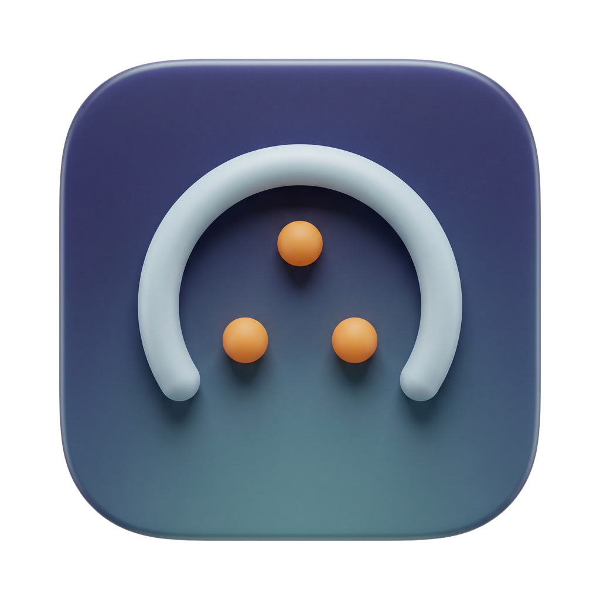

<p align="center">
  
</p>

<h1 align="center">Herdr Bar</h1>

<p align="center">
  Live status of your <a href="https://herdr.dev">Herdr</a> coding agents in the macOS menu bar.<br>
  <a href="https://bagusrizkis.github.io/herdr-bar">bagusrizkis.github.io/herdr-bar</a>
</p>

Herdr Bar sits in the menu bar and shows what every agent in Herdr is doing, so you can work on
something else and glance up. Click it for the full list, peek at an agent's last message, and get
a notification when an agent needs your input or finishes.

## Features

- **Live icon.** One glyph, four states: idle, working (with a count badge), needs input (`!` badge),
  and disconnected. The icon never changes width with the numbers.
- **Popover.** Agents grouped by space, or as a priority queue (blocked → working → done → idle),
  mirroring Herdr's own `agent_panel_sort`. Time since the last status change per agent.
- **Peek.** The agent's last message, pulled from the pane, without switching to the terminal.
- **Notifications.** When an agent needs input or finishes. Per-workspace mute, optional sound.
- **Multi-session.** Default and named Herdr sessions are discovered automatically.
- **Push, not polling.** One streaming subscription to Herdr's socket API; every change arrives as
  an event.

## Install

Requires macOS 26 and [Herdr](https://herdr.dev) 0.9 or newer.

```sh
# Homebrew (Homebrew 7 asks you to trust third-party taps once)
brew trust bagusrizkis/tap
brew install --cask bagusrizkis/tap/herdr-bar

# or the install script
curl -fsSL https://raw.githubusercontent.com/bagusrizkis/herdr-bar/main/install.sh | sh
```

Or download the DMG from the [latest release](https://github.com/bagusrizkis/herdr-bar/releases/latest)
and drag Herdr Bar to Applications.

Releases are signed with a Developer ID certificate and notarized by Apple.

## Herdr plugin (optional)

Herdr Bar can also be installed as a Herdr plugin, which launches the app when the Herdr server
starts and forwards agent status events to it:

```sh
herdr plugin install bagusrizkis/herdr-bar
```

Then set `[ui.toast] delivery = "off"` in `~/.config/herdr/config.toml` so you don't get the same
notification twice.

## Build from source

```sh
git clone https://github.com/bagusrizkis/herdr-bar.git
cd herdr-bar
scripts/build-app.sh          # → build/Herdr Bar.app
open "build/Herdr Bar.app"
scripts/build-dmg.sh          # → build/HerdrBar-<version>.dmg
```

The app is a plain Swift package (`Package.swift`); no Xcode project is needed. Xcode 26 / Swift 6.2
provides the toolchain.

## How it works

Herdr exposes a Unix socket at `~/.config/herdr/herdr.sock` speaking newline-delimited JSON.
Herdr closes the connection after answering one ordinary request, so Herdr Bar keeps exactly one
long-lived connection for `events.subscribe` and opens a short-lived connection for every other
call (`session.snapshot`, `agent.read`). Any event triggers a debounced snapshot refetch; the diff
drives the icon, the list and notifications.

```
Sources/HerdrBar/
  HerdrBarApp.swift   MenuBarExtra + app delegate (URL scheme)
  HerdrClient.swift   socket client: streaming + one-shot calls
  SessionStore.swift  session discovery, snapshot/diff, reconnect
  Models.swift        Codable models for the Herdr API
  StatusIcon.swift    menu bar template image renderer
  PopoverView.swift   the popover UI
  Settings.swift      preferences + settings window
  Notifier.swift      user notifications
Design/               app icon, menu bar glyph sources, design notes
plugin/               Herdr plugin hooks (see herdr-plugin.toml)
site/                 GitHub Pages landing page
install.sh            curl | sh installer
```

The Homebrew cask lives in [bagusrizkis/homebrew-tap](https://github.com/bagusrizkis/homebrew-tap); its
`version` and `sha256` are bumped after each release.

## License

MIT — see [LICENSE](LICENSE).
